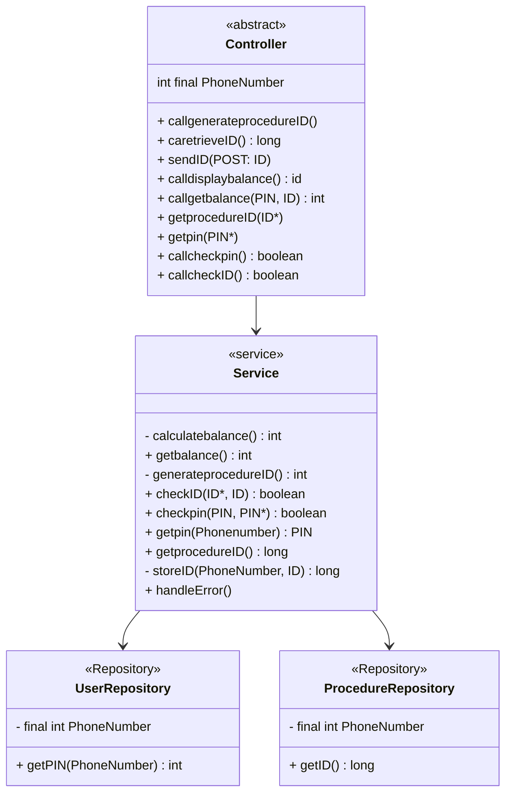

# VALIDATE PIN AND DISPLAY BALANCE
### Description:
This documentation brings out and describes the strategies used to design the backend of the PIN validation and balance display functionality of the PowerPay app.

## Table of content
- [Objectives](#description)
- [How to achieve this objectives](#implementation-of-the-validate-pin-and-display-balance)
- [Design Patterns](#Possible)
- [Visual Representation](#ClASSDiagram)


## Implementation Of The Validate PIN And Display Balance

To validate user PIN input and display their balance there are some key <br>
points which must be first considered.

1. When the should validation begin
2. How the validation should be done and its result(balance) obtained
3. What happens in cases of unexpected behaviours such as invalid user input

The entity in the system that will be responsible for managing the validation of a user's PIN and the display of his balance is the ```checkBalance``` class<br>

This ```check_balance```class is a subclass of the ```procedure```class which is the parent class of all the classes that handle actions that the PowerPay app carrys out.

The calculation of the balance is done through a ```TransactionManager```class which is responsible for accessing the storage location of all user transactions in order to sum the transaction amounts and hence get the user's actual balance.

## How the ```check_balance``` class resolves the key points raised above

1. **When should the validation begin**<br>
   The validation process of the PIN for the display of a user's balance begins after the user has input his PIN at the frontend for confirmation. This ```PIN``` is passed to the backend along with an implicit/hidden ```ProcedureID``` that was embedded in the frontend pages for identification prior to this.

2. **How should The validation be done**<br>

- At this point, the ```validatePINForBalance(PIN*, ProcedureID)``` method is called. This method using the ProcedureID passed to it as parameter attempts to retrieve the ```PhoneNumber``` associated with this ```ProcedureID``` by querying the data structure where the storage of the **{PhoneNumber,ProcedureID}** is done. If successful, it proceeds to the next step.

- Next,```validatePINForBalance(PIN, ProcedureID)``` attempts to retrieve the ```PIN```of the user account registered with the acquired ```PhoneNumber``` and compares it with the ```PIN*``` that was passed as parameter to it.  <br>

-  If this check goes successfully then the two **PIN**s match and so the balance of the user account with that Phone Number is calculated via the ```calculatebalance(PhoneNumber)``` method found in the ```TransactionManager```class and then is finally passed to the frontend via ```POST``` methods.<br>

3. **Unexpected and Error Conditions**<br>
- In cases of errors such as **wrong user input (that is, the user enters a wrong PIN),** or **errors related to connectivity(such as poor network connection)** we gracefully handle them by displaying appropriate error messages.

# Possible design patterns for the implementation of the CheckBalance class

A design pattern is a general repeatable solution to a commonly occurring problem in software design. The Design Patterns which could be used for this implementation are:

1.	**Singleton Pattern:** 
The Singleton pattern a type of creational design  that ensures only one instance of a class is created throughout the application's lifecycle, and provides a global point of access to that instance. It simply restricts the instantiation of a class to a single object, allowing all parts of the application to access and use that single instance. Since we will have cases where we need to access data from the the User Storage location and Procedure Storage location, it will be good to have a single instance of a database connection which  will be used by parts of the application rather than creating multiple instances.

2.	 **The Repository pattern:**
It provides an abstraction layer between the application logic and the data persistence layer(the part of a software system that is responsible for storing and retrieving directly from the database). It separates the data access logic from the rest of the application, allowing for a more modular and maintainable codebase. Since we have data storage facilities holding user data and procedure data, it would be nice to separate the actual storing and retrieving logic from the rest of the application or for the process needed. 

### CLASSDiagram

