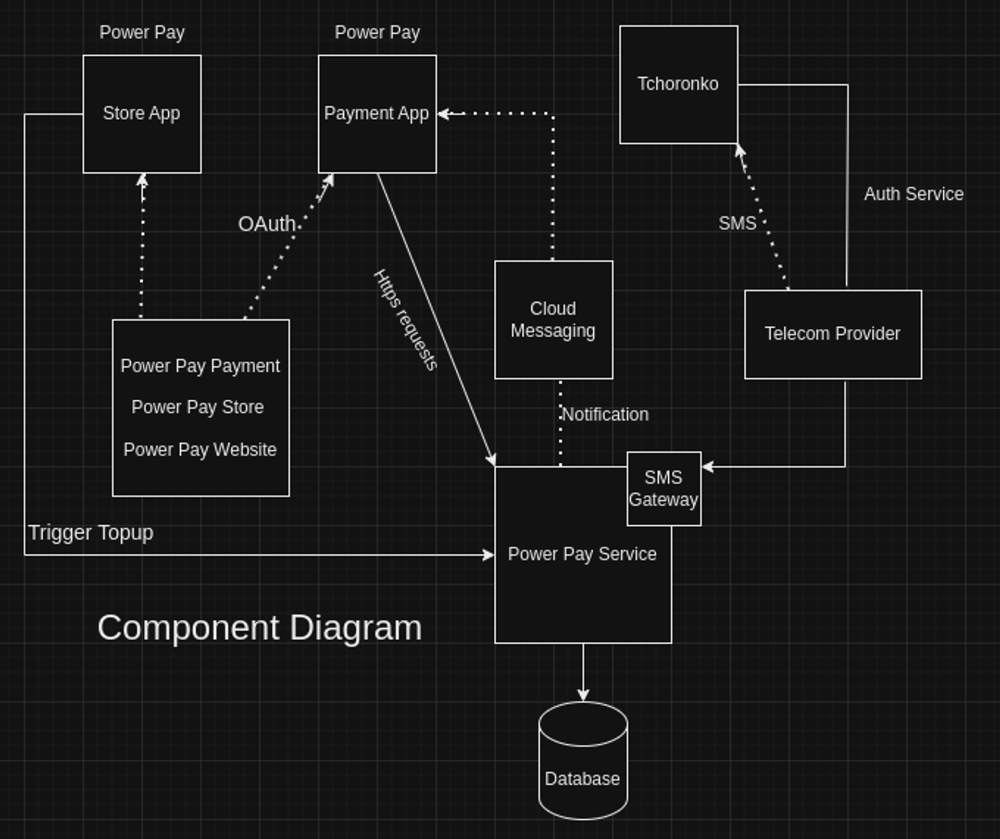

# Project Overview

The Power Payment Backend is a cutting-edge system designed to facilitate seamless money transfers between users through a Progressive Web App (PWA). The primary purpose of the project is to provide a secure and user-friendly platform for users to send and receive money electronically.

The target audience for this project includes individuals, businesses, and organizations that require a reliable and efficient payment solution. Whether it's friends splitting bills, businesses paying suppliers, or organizations distributing funds, the Power Payment Backend caters to a wide range of users.

By offering a convenient and intuitive user interface, along with robust security measures, the project aims to provide a hassle-free experience for users when transferring funds. The system is designed to be scalable, ensuring it can handle a growing user base and high transaction volumes.

With its advanced technology stack and meticulous attention to detail, the Power Payment Backend sets out to meet the needs of users who value simplicity, speed, and security in their financial transactions.

# Architecture and Technologies

The Power Pay Backend is a robust and highly efficient system that facilitates seamless money transfers between users through a state-of-the-art progressive web application (PWA). It comprises multiple components, including the Power Pay Store, the Power Pay Service, SMS Gateway, Power Pay App, and a scalable and secured Database. The different components will be explained in the following lines.

# System Components

    1. Power Pay Store: 
    
        This component serves as a dedicated App for topping up kiosk accounts. It seamlessly communicates with the Power Pay Service using a Restful API, ensuring efficient and reliable account management.

    2. SMS Gateway: 

        The SMS Gateway is a crucial component responsible for interpreting requests originating from the Choronko users and seamlessly translating them into a format compatible with the Power Pay Service. By receiving and intelligently interpreting SMS messages, the SMS Gateway bridges the gap between Choronko users and the backend. It effectively relays information to the Power Pay Service, which processes the requests and promptly resonds. The SMS Gateway then relays the response back to the Choronko user, ensuring a seamless user experience.

    3. Power Pay Service: 
    
        This is the core of the backend which intelligently processes all requests and orchestrates the system's intricate logic. This service intuitively interacts with the Power Pay App, SMS Gateway, and the Power Pay Store via RESTful APIs, ensuring smooth and reliable communication channels.

    4. Power Pay App:

        A cutting-edge PWA, empowers users to effortlessly create accounts, top up their balances, access transaction history, and seamlessly transfer money to other users. Leveraging RESTful APIs, the Power Pay App extensively communicates with the Power Pay Service, enabling swift and secure execution of these essential actions.

    5. Database:

        The database acts as the robust repository for user data, transaction history, and account balances. Meticulously designed, the database schema ensures optimum data integrity, security, and scalability, enabling efficient storage and retrieval of critical information.

# Technologies and tools used for backend

    1. GCP/AWS (Deployment):

        * The Power Payment Backend can be deployed on cloud platforms such as Google Cloud Platform (GCP) or Amazon Web Services (AWS).
        * These cloud platforms provide infrastructure services that enable easy provisioning, scaling, and management of the backend application.
        * The backend can be deployed using cloud-native technologies like Kubernetes or serverless computing to ensure high availability, scalability, and fault tolerance.

    2. Database (Cloud Native for database component):

        * The database component of the Power Payment Backend can be implemented using a cloud-native database service.
        * For example, on GCP, you can use Cloud Spanner, Cloud SQL, or Firestore. On AWS, you can use Amazon RDS, Amazon DynamoDB, or Amazon Aurora.
        * These cloud-native databases offer managed services that handle scalability, replication, backups, and security, allowing the backend to leverage the benefits of cloud computing.

    3. Java (Spring Boot for Power Pay Service):

        * The Power Pay Service can be developed using Java and the Spring Boot framework.
        * Spring Boot provides a simplified way to build Java applications by handling common configurations and dependencies.
        * With Spring Boot, you can create RESTful APIs, handle request processing, and implement business logic for the Power Payment Backend.
        * Java's robustness, scalability, and extensive ecosystem make it a suitable choice for developing the backend service.

    4. GitHub Pages (For website deployment):

        The Power Pay App, built using React JS, can be deployed on GitHub Pages to provide users with an intuitive and interactive web interface for topping up their kiosk accounts.

    5. SMS Gateway (Twilio):

        * Twilio can be used as the SMS Gateway for the Power Payment Backend.
        * Twilio provides a programmable SMS API that allows you to send and receive SMS messages programmatically.
        * The SMS Gateway component will integrate with Twilio's API to interpret incoming SMS requests from Choronko users and translate them into a format compatible with the Power Pay Service.
        * It will also utilize Twilio's API to send responses back to the users, ensuring seamless communication between the backend and Choronko users via SMS.

    6. JavaScript (React JS for Power Pay Store App and Power Pay App):

        * React JS provides a component-based architecture that enables the creation of interactive user interfaces.
        * The Power Pay Store App, deployed on GitHub Pages, can be developed using React JS to provide a user-friendly web interface for topping up kiosk accounts.
        * The Power Pay App, which allows users to create accounts, access transaction history, and transfer money, can also be developed using React JS to deliver a rich and responsive user experience.

    7. Postman

        Postman will be utilized as the testing tool for the API. As a widely adopted API testing tool, Postman offers a user-friendly interface that simplifies the process of sending HTTP requests and receiving responses. It empowers developers to customize various aspects of the API requests, such as headers, query parameters, request bodies, and authentication methods.

        With Postman, we can efficiently organize our API requests into collections, facilitating the management and execution of multiple requests as part of a workflow or test suite. Additionally, we can create environments within Postman to store variables specific to different environments (e.g., development, staging, production), streamlining the management of environment-specific configurations.

# API Documentation

    The Power Payment Backend exposes various APIs with the following endpoints:

        - POST /api/users: Create a new user account. Request body should include user details.
        - POST /api/payments: Initiate a money transfer between users. Request body should include transfer details.
        - GET /api/payments/{paymentId}: Get details of a specific payment by ID.
        - GET /api/users/{userId}/transactions: Get transaction history for a specific user.
        - DELETE /api/users/{userId}: Delete a user account by ID.

For each endpoint, provide examples of requests and responses along with the expected request and response formats.

# Database Schema

    The Power Payment Backend is a secure system for seamless money transfers. Here's an example of the database schema that supports it.

    - User Table:

        user_id (Primary Key)
        username
        email
        password
        date_created

    - Transaction History Table:

        transaction_history_id (Primary Key)
        transaction_id (Foreign Key referencing Transaction Table)
        status (e.g., pending, completed, failed)
        date_updated

    - Transaction Table:

        transaction_id (Primary Key)
        sender_id (Foreign Key referencing User Table)
        receiver_id (Foreign Key referencing User Table)
        amount
        date_created

This schema includes tables for users, transactions, and transaction history. The user table stores user information, including username, email, and password. The transaction table tracks payment transactions between users, including sender, receiver, and amount. The transaction history table records the status and update timestamps for each transaction. Keep in mind that this is a basic example, and the actual database schema for the Power Pay App may require additional tables and relationships. 

# Authentication

    In the backend, the authentication process for smartphone and Choronko users in the Power Payment system are handled using specific mechanisms and workflows.

        1. Smartphone User Authentication:

            * User Registration: When a smartphone user registers, they provide their phone number, which is stored in the user database.
            * OTP Generation and Delivery: Upon registration, an OTP is generated and sent to the user's phone number via SMS using an SMS gateway or service provider.
            * OTP Verification: The backend validates the OTP entered by the user against the one stored in the database. If the OTP matches, the user is considered authenticated.
            * PIN Setup: After successful OTP verification, the user is prompted to set a PIN for subsequent authentication. The PIN is securely stored in the user database, preferably using hashing and salting techniques.
            
        2. Choronko User Authentication:

            * SMS Gateway Integration: The backend integrates with an SMS gateway to receive and interpret messages sent by Choronko users.
            * Syntax Interpretation: The SMS gateway extracts the phone number and PIN from the incoming message using the specified syntax, such as numberpin#.
            * PIN Verification: The backend verifies the received PIN against the one stored in the Choronko user's database record. If the PIN matches, the user is considered authenticated.

# Error Handling

    Error handling is an essential aspect of any application, including the Power Payment Backend, to ensure smooth operation and a positive user experience. Proper error handling involves identifying, capturing, and appropriately responding to errors that may occur during the execution of backend processes. Below is an explanation of how error handling should be done in the backend, along with examples:

    - HTTP Status Codes:

        The app utilizes appropriate HTTP status codes to indicate the nature of the error, allowing clients to understand the response at a glance.

        For example, a 400 status code can be used for client-side errors (e.g., invalid request parameters), while a 500 status code can be used for server-side errors (e.g., internal server errors).

    - Error Logging and Notification:

        Errors should be logged to a centralized logging system or a dedicated log file, along with relevant information such as timestamps, error messages, and stack traces. This allows developers and system administrators to monitor and troubleshoot issues effectively.
        Notifications or alerts can be triggered to notify the appropriate individuals or teams when critical errors occur. This ensures that prompt action can be taken to address and resolve the issues.

    - Exception Handling:

        Exceptions should be caught and handled appropriately to prevent application crashes and provide meaningful feedback to the user.

        Example: If a database connection error occurs while processing a payment transaction, an exception can be caught, and the user can be informed that there was a temporary issue and to try again later.

    - User-Friendly Error Messages:

        Error messages should be user-friendly, informative, and provide actionable instructions or suggestions whenever possible.

        Example: If a user attempts to authenticate with an incorrect PIN, they can be presented with an error message stating, "Invalid PIN. Please double-check your PIN and try again."

    - Graceful Degradation:

        The backend should gracefully handle errors and degrade functionality when necessary to maintain system stability and prevent cascading failures.

        Example: If an external API used for a specific feature is temporarily unavailable, the backend can gracefully degrade by presenting an alternative workflow or disabling the feature temporarily until the API becomes accessible again.

    - Error Response Formats:

        The backend should provide consistent error response formats, such as JSON or XML, that include relevant error codes, messages, and additional details for easier identification and debugging by client applications.

        Example: An API request that fails due to missing required parameters can return a JSON response with an appropriate error code (e.g., 400 Bad Request) and a message indicating the missing parameters.

    - Input Validation and Sanitization:

        Input data should be validated and sanitized to prevent common security vulnerabilities such as SQL injection or cross-site scripting (XSS) attacks.

        Example: Prior to processing a user's input for a payment amount, the backend should validate that it is a valid numeric value and sanitize it to remove any potential harmful characters.

# Testing

    Each backend feature of the Power Pay app should undergo thorough testing using written code or test frameworks to ensure its functionality and reliability. By writing test cases and using appropriate frameworks, you can automate the testing process and identify potential issues early on. Here are some examples of how different backend features can be tested:

    1. User Authentication:

        Testing Framework: JUnit or TestNG

        Example: Write test cases to validate user authentication by simulating login requests with different credentials and asserting the expected behavior, such as successful login or authentication failure.

    2. Payment Processing:

        Testing Framework: JUnit or TestNG

        Example: Create test cases to verify payment processing functionality, including mocking external payment gateways and asserting the correct calculation of transaction fees and the update of user balances.

    3. Transaction History:

        Testing Framework: JUnit or TestNG

        Example: Write test cases to ensure the accuracy of transaction history by simulating requests for transaction records, filtering by date range or transaction type, and asserting the correct display of transaction details.

    4. Error Handling:

        Testing Framework: JUnit or TestNG

        Example: Test the backend's error handling capabilities by writing test cases that intentionally trigger errors, such as sending invalid inputs or simulating database connection failures, and asserting the correct error responses or exception handling behavior.

# Conclusion

    The Power Payment Backend leverages modern and industry-leading technologies, including Spring Boot, PostgreSQL, and a RESTful API architecture. This technology stack guarantees optimum performance, scalability, and security. Rigorous testing practices, encompassing unit tests, integration tests, and end-to-end tests, ensure the system's reliability and stability. The deployment process is streamlined through a CI/CD pipeline, guaranteeing consistent and seamless deployments, backed by thorough testing.

    Designed with ease of use, maintenance, and extensibility in mind, the Power Payment Backend follows a highly modular architecture. Changes made to one component have minimal impact on other components, promoting flexibility and efficiency. The system boasts exceptional scalability, effortlessly accommodating a growing user base and high request volumes. Security is a top priority, with stringent measures in place to safeguard user data and transactions, instilling confidence in the system's integrity and privacy.