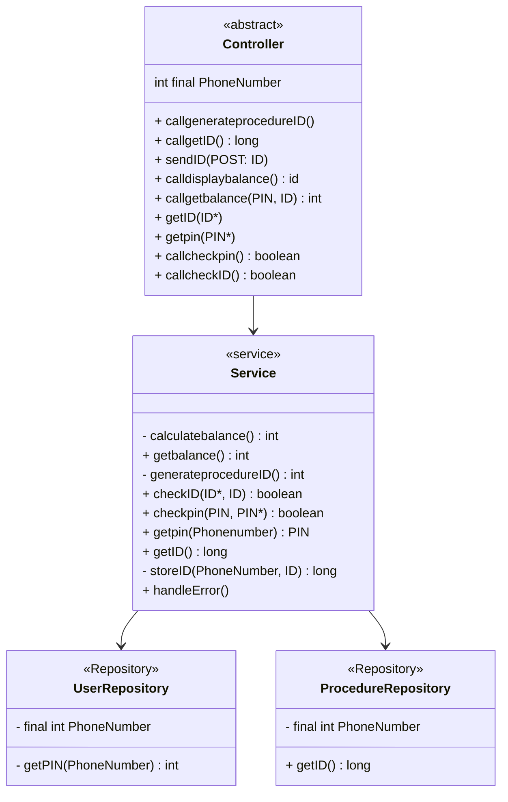

# VALIDATE PIN AND DISPLAY BALANCE 
### Description:
This documentation brings out and describes the strategies and tools used to design the backend of the PIN validation and balance display functionality of the PowerPay app using SpringBoot in java.
        
## Table of content
- [Objectives](#description)
- [How to achieve this objectives](### Implementation Of The Validate PIN And Display Balance)
- [Technical Considerations and Decisions](#TechincalsConsiderations)
- [Visual Representation](#ClASSDiagram)


## Prerequisites
- We need To initialize a [SpringBoot](https://start.spring.io/)
project


## Implementation Of The Validate PIN And Display Balance

To validate user PIN input and display their balance there are some key <br>
features which must be first considered. These implementation issues are:

1. When the should validation begin
2. How the validation should be done and its result(balance) obtained
3. What happens in cases of unexpected behaviours such as invalid user input

This documentation focuses on explaining the methods and procedures used in achieving the goals raised by the above points.<br>
The system is made up of three core entitties which interact for its implemention.<br>
- SERVICE
- CONTROLLER
- REPOSITORY

**CONTROLLER**
>The controller layer controls the routing and mapping of urls. It also make calls to the SERVICE and obtain the values from it.
>Additionally, it makes these values accessible to the frontend for display.

**SERVICE**
>The service layer controls the business logic of the system and performs all calculations and computations.
>It can be thought of as the engine of this part of the backend.

**REPOSITORY**
>This represents the base layer which acts as the intermediate between the service layer and the database. It is through it that most of the data is gotten such as the user's PIN and their balance.

NB: These layers should be implemented as packages in the backend.
#
## How they resolve the Implementation issues raised above
                    
 1. **When should the validation begin**<br>
    The validation process to display the user's balance typically begins when the user at the frontend makes a get request using an API to the service requesting for a balance check.
    
 2. **How should The validation be done**<br>
   - The service the recognises this request by the use of a Rest api ``` @Requestmapping('home/checkbalance/')``` for example.<br>

   - When this Rest api is triggered, it then makes a call to the ``` generateprocedureID```method which is implemented in the.<br>
 in the **SERVICE** layer of our application and will serve to generate a ```procedureID``` that will uniquely identify this new procedure engaged by the user.
   - After the ```procedureID``` is generated, a ```storeID(GeneratedID)``` function implemented at the **REPOSITORY** layer takes this ```procedureID``` along with the **Phone Number** of the user and stores them as a key-value pair in the database.

   - After that, the **CONTROLLER** layer forwards the ```procedureID```  to the frontend of the PowerPay application via a ```POST``` method. This is so that the frontend action that asks the user for his PIN will have this ID associated with it for later confirmation.
.<br>
  - The user confirms his PIN at the frontend level. The **CONTROLLER** layer handles this ```POST``` request and retrieves from it the ```ProcedureID``` and the user's **PIN*** 

  - At this point, the **CONTROLLER** layer automatically calls the ```checkProcedureID``` method found in the **SERVICE** layer which compares the incoming ```ProcedureID*``` with ```ProcedureID``` found in the database  by using the ```getProcedureID(key: Phone Number)->value(ProcedureID)``` method still in the **SERVICE** layer. If successful, it proceeds to the next step.

  - Next, the **CONTROLLER** layer calls the ```getPIN(PhoneNumber)``` method, implemented in the **REPOSITORY** layer, which takes the user's **PhoneNumber** and gets the corresponding PIN from the database and then calls ```checkPIN(PIN)``` which compares **PIN** gotten from the database by calling the ```getPIN(PhoneNumber)``` method against incoming **PIN***.<br>
 
  - If this check goes successfully then **CONTROLLER** layer calls the ```calculatebalance(PhoneNumber)``` and ```getbalance()``` **SERVICE** layer methods sequentially. The ```calculatebalance(PhoneNumber)``` method calculates the user's balance and the ```getbalance()``` method obtains and passes it them to the frontend via ```POST``` methods.<br>

3. **Unexpected and Error Conditions**<br>
  - In cases of errors such as wrong user input (that is the user enters a wrong PIN), errors related to connectivity(such as poor network connection) we gracefully handle them by displaying appropriate error messages.
  - This is done with the help of a handleError method implemented in the service layer of our system.
    

 ## Techincals Considerations and Optimizations
- This Implementation takes the **CONTROLLER** layer as an interface which has with abstract methods for making function calls and retrieving their return values
- The **SERVICE** layer is made of pure functions(methods) which causes no side effects to avoid unexpected behaviours
- These layers are implemented as packages in the backend as it wmakes the scope of the code in them clearer
###                                             CLASSDiagram

