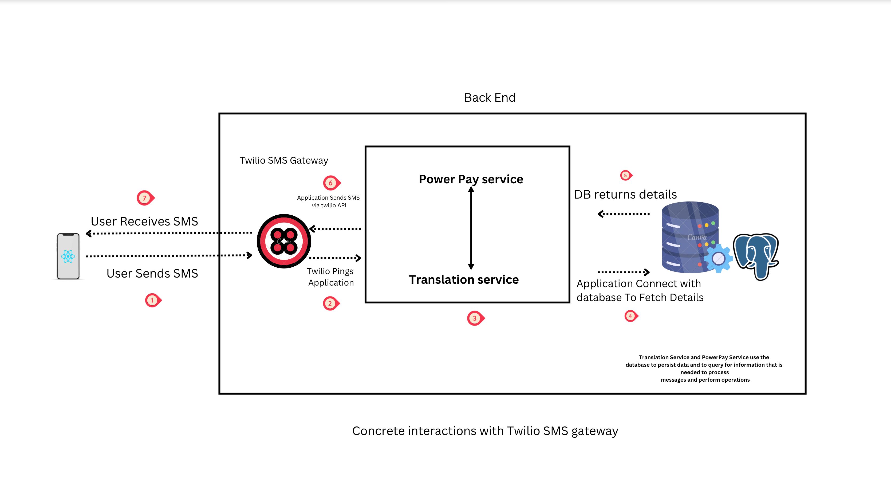

# PowerPay Translator

This service in the microservice architecture should get messages from the twilio and send to the P.P.Service.

# Translation Service Backend

The Translation Service backend is a microservice in the PowerPay system that handles messages received from the Twilio SMS gateway and forwards them to the PowerPay Service. The Translation Service backend is responsible for:

Receiving messages from the Twilio SMS gateway
Parsing and validating the messages
Forwarding the messages to the PowerPay Service
Handling errors and retries
Logging and monitoring


# Components

The Translation Service backend consists of the following components:

Twilio SMS Gateway: A third-party service that sends SMS messages to the Translation Service backend.
Translation Service: A Rust-based microservice that receives messages from the Twilio SMS gateway, parses and validates the messages, and forwards them to the PowerPay Service.
PowerPay Service: A microservice that processes the messages and performs the necessary operations, such as sending money, registering users, and checking balances.
Database: A cloud-native database that stores all the necessary information for the system to operate, such as user data, transaction history, and account balances.

# Interactions

The Translation Service backend interacts with the following components:

Twilio SMS Gateway: The Translation Service backend receives messages from the Twilio SMS gateway using the Twilio API.
PowerPay Service: The Translation Service backend forwards messages to the PowerPay Service using the PowerPay API.
Database: The Translation Service backend reads and writes data to the database as needed.

# Technology

The Translation Service backend is built using the following technology:

Rust: A performant, reliable, and secure programming language for the backend.
Twilio API: A third-party API for sending and receiving SMS messages.
PowerPay API: A custom API for processing messages and performing operations in the PowerPay system.
Cloud-native database: A scalable and highly available database for storing system data.
Cloud platform: A cloud platform, such as GCP or AWS, for deploying the Translation Service backend.


# Architecture <a name="architecture"></a>

The architecture of the Translation Service backend consists of the following components:

API Gateway: Receives requests from external clients and forwards them to the Translation Service backend.
Translation Service Backend: Processes requests, performs translation where necessary, and forwards them to the PowerPay service.
PowerPay Service: Receives translated requests from the Translation Service backend and processes them accordingly.
The Translation Service backend acts as an intermediary between the API gateway and the PowerPay service, ensuring seamless communication by translating data as required.


# Integration with PowerPay Service <a name="integration-with-powerpay-service"></a>

The Translation Service backend integrates with the PowerPay service through a series of API calls. It forwards translated requests to the appropriate endpoints within the PowerPay service, ensuring that translated data is seamlessly transmitted and processed.


# Error Handling <a name="error-handling"></a>
The Translation Service backend includes robust error handling mechanisms to address any issues that may arise during translation or communication with the PowerPay service. This includes:

Error Detection: Identifying errors during translation or data transmission.
Error Reporting: Logging errors and notifying relevant stakeholders for resolution.
Fallback Mechanisms: Implementing fallback mechanisms to handle errors gracefully and maintain system stability.


# Deployment

The Translation Service backend is deployed to a cloud platform, such as GCP or AWS, for high availability and scalability. The backend is packaged as a Docker container and deployed using a Docker Compose file. The container includes all the necessary dependencies and configurations for the backend to run.

# Monitoring and Logging

The Translation Service backend includes monitoring and logging capabilities to ensure that the system is operating correctly and to diagnose and troubleshoot issues. The backend logs all requests, responses, and errors, and sends the logs to a centralized logging service for analysis and alerting. The backend also includes metrics and monitoring capabilities to track the performance and health of the system.


# Concrete interactions between different components 

The Translation Service backend interacts with the following components:

Twilio SMS Gateway: The Translation Service backend receives messages from the Twilio SMS gateway using the Twilio API detailed description cam be found here on using twilio API'S 

https://www.twilio.com/docs/messaging/api#send-messages 


. When a message is received, the Translation Service extracts the necessary information, such as the sender's phone number, the recipient's phone number, and the message content. The Translation Service then validates the message and forwards it to the PowerPay Service for further processing.
PowerPay Service: The Translation Service forwards messages to the PowerPay Service using the PowerPay API. The PowerPay Service processes the message and performs the necessary operations, such as sending money, registering users, and checking balances. Once the operation is complete, the PowerPay Service sends a response back to the Translation Service, which then forwards the response to the Twilio SMS gateway to be sent back to the user as an SMS message.
Database: The Translation Service and PowerPay Service both read and write data to the database as needed. The database stores all the necessary information for the system to operate, such as user data, transaction history, and account balances. The Translation Service and PowerPay Service use the database to persist data and to query for information that is needed to process messages and perform operations.

These interactions are illustrated in the following diagram:



# Defining between component Applcation Programming Interface

Twilio SMS Gateway API

The Twilio SMS Gateway API is a third-party API that is used to send and receive SMS messages. The Translation Service backend uses the Twilio API to receive messages from the Twilio SMS Gateway.

Here is an example of how to send an SMS message using the Twilio API, you can refare this url for more information on the implementation. 
https://www.twilio.com/docs/glossary/what-is-sms-api-short-messaging-service

````js
use twilio::TwilioClient;
use twilio::twiml::MessagingResponse;

let client = TwilioClient::new("ACCOUNT_SID", "AUTH_TOKEN");
let mut response = MessagingResponse::new();
response.message("Hello, world!");

let twiml = response.to_string();
let result = client.messages.create(
    "TO_NUMBER",
    Some("FROM_NUMBER"),
    Some(&twiml),
);
In this example, the TwilioClient is used to send an SMS message to the specified phone number. The MessagingResponse object is used to generate the TwiML response, which is then sent to the Twilio SMS Gatew
````

Translation Service API
The Translation Service API is a custom API that is used to receive messages from the Twilio SMS Gateway, parse and validate the messages, and forward them to the PowerPay Service. The Translation Service API is implemented as a Rust-based microservice.

Here is an example of how to use the Translation Service API to send a message:
````rust
use reqwest::Client;
use serde_json::Value;

let client = Client::new();
let message = json!({
    "sender": "555-555-5555",
    "recipient": "555-555-5556",
    "content": "Hello, world!"
});

let response = client.post("http://localhost:8080/messages")
    .json(&message)
    .send()
    .await?
    .json()
    .await?;

println!("{}", response);

In this example, the Client object is used to send a POST request to the /messages endpoint of the Translation Service. The request body contains the message data, which is in JSON format. The Translation Service parses and validates the message, and then forwards it to the PowerPay Service.
````

PowerPay Service API
The PowerPay Service API is a custom API that is used to process messages and perform the necessary operations, such as sending money, registering users, and checking balances. The PowerPay Service API is implemented as a microservice.

Here is an example of how to use the PowerPay Service API to send money:
````rust
use reqwest::Client;
use serde_json::Value;

let client = Client::new();
let transfer = json!({
    "sender": "555-555-5555",
    "recipient": "555-555-5556",
    "amount": 100
});

let response = client.post("http://localhost:8081/transfers")
    .json(&transfer)
    .send()
    .await?
    .json()
    .await?;

println!("{}", response);

In this example, the Client object is used to send a POST request to the /transfers endpoint of the PowerPay Service. The request body contains the transfer data, which is in JSON format. The PowerPay Service processes the transfer and sends a response back to the Translation Service, which then forwards the response to the Twilio SMS gateway to be sent back to the user as an SMS message.
````
The Table below summarizes the operations on the API endpoints for the Translation Service backend:

| Endpoint | Method |Description |
|-----------------|-----------------|-----------------|
| /messages  | POST   |Receive a message from the Twilio SMS Gateway, parse and validate it, and forward it to the PowerPay Service. The request body should contain the following fields: sender (the phone number of the sender), recipient (the phone number of the recipient), and content (the content of the message).    |
| /transfers	  | POST   | Process a transfer request. The request body should contain the following fields: sender (the phone number of the sender), recipient (the phone number of the recipient), and amount (the amount of money to be transferred). The PowerPay Service will process the transfer and send a response back to the Translation Service, which will then forward the response to the Twilio SMS gateway to be sent back to the user as an SMS message.
  |


# Conclusion

The Translation Service backend is a critical component in the PowerPay system that enables users to send and receive money, register with the system, and check their balances. The backend is built using Rust and interact with the Twilio SMS gateway, the PowerPay Service, and the cloud-native database. The backend is deployed to a cloud platform for high availability and scalability, and includes monitoring and logging capabilities to ensure that the system is operating correctly.